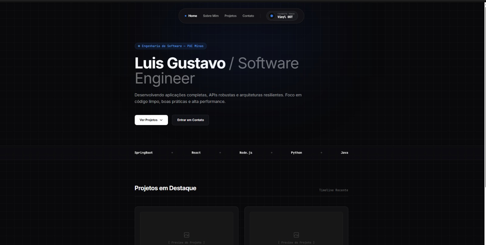
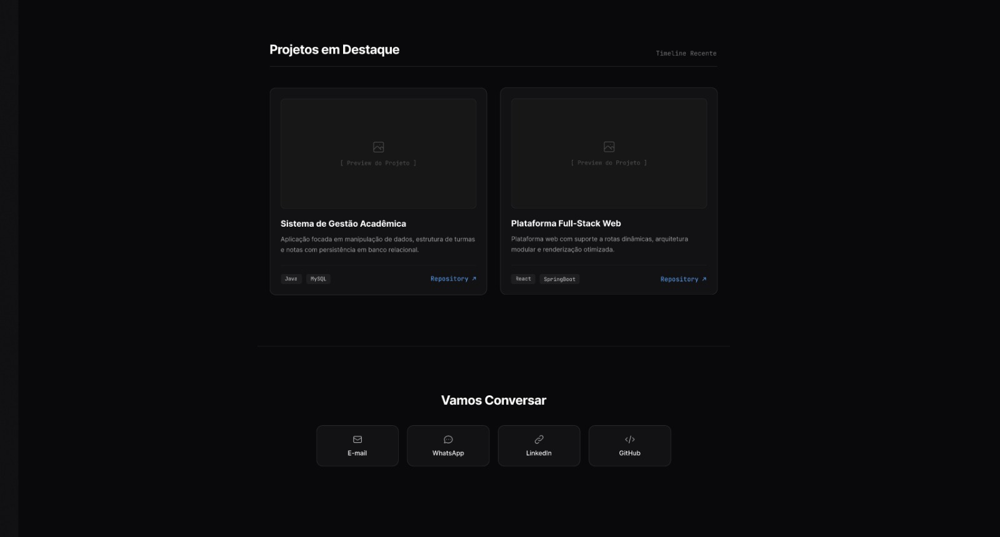
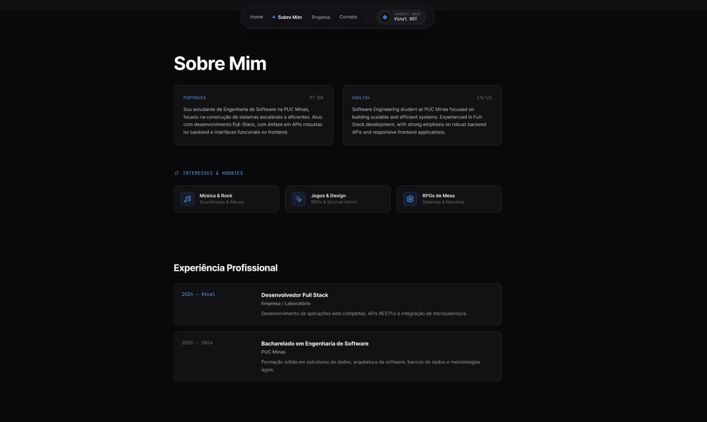

# Portfólio — Luis Gustavo

Website de portfólio profissional desenvolvido para a disciplina de **Laboratório de Desenvolvimento de Software** (PUC Minas — Engenharia de Software, Prof. Glender Brás). O objetivo é apresentar trajetória, habilidades, projetos e formas de contato de maneira moderna e acessível.

> Status atual: **Sprint 2 (Lab01S02)** — conteúdo das páginas, formulário funcional e níveis de acesso implementados. Conteúdo pessoal ainda está com placeholder (lorem ipsum) — ver seção [Conteúdo pendente](#conteúdo-pendente).

## Sobre o projeto

O site é dividido em **2 páginas**, cobrindo as 4 seções exigidas pelo laboratório sem a necessidade de uma rota por seção:

| Página | Rota | Seções |
|---|---|---|
| Home | `/` | Hero, Stack tecnológica, **Projetos**, **Contato** |
| Sobre | `/sobre` | **Sobre Mim** (PT/EN), **Experiências**, Interesses & Objetivos |

### Níveis de acesso (Sprint 2)

O navbar tem um seletor de perfil — **Visitante**, **Recrutador** ou **Técnico**. A escolha fica salva no navegador e muda a **ordem/prioridade** do conteúdo em ambas as páginas (nada é escondido, só reorganizado):

- **Recrutador** → banner com a experiência mais recente logo após o Hero; seção de Experiências vem primeiro na página Sobre; botão principal do Hero leva direto pra lá.
- **Técnico** → Projetos aparecem antes da faixa de stack na Home; botão principal do Hero foca em repositórios.
- **Visitante** → ordem padrão, visão equilibrada.

Documentação completa (requisitos, user stories e diagrama de casos de uso) em [`docs/requisitos-niveis-acesso.md`](./docs/requisitos-niveis-acesso.md).

### Detalhes de identidade visual

- **Stack tecnológica**: faixa em marquee contínuo (loop suave), com os logos de cada tecnologia puxados via hotlink de [logos.lndev.me](https://logos.lndev.me/) e forçados pra monocromático via CSS (`filter: brightness(0) invert(1)` + opacidade reduzida) — assim funciona independente da cor original de cada marca.
- **Música (popover do disco de vinil)**: agora toca de verdade, baixinho, e a `AmbientGlow` (o brilho azul de fundo) pulsa em sincronia com o áudio via Web Audio API (`AnalyserNode`), de forma suave. **Importante**: as 3 faixas (Baldur's Gate 3, Resident Evil, One Piece) são música comercial licenciada — eu não posso fornecer os arquivos. O player já está funcional, só falta você colocar seus próprios `.mp3` em `codigo/public/audio/` (instruções no README daquela pasta) ou trocar por trilhas royalty-free.
- **Cards de projeto**: efeito de brilho que segue o cursor ao passar o mouse (inspirado no estilo de componentes do [21st.dev](https://21st.dev/), reimplementado do zero em CSS + React — não foi copiado de lá).

## Tecnologias utilizadas

- [React](https://react.dev/) — biblioteca de interface
- [Vite](https://vitejs.dev/) — build tool e dev server
- [React Router DOM](https://reactrouter.com/) — navegação entre páginas
- [Framer Motion](https://www.framer.com/motion/) — transições de página e animações
- [Tailwind CSS](https://tailwindcss.com/) — estilização utilitária
- Fontes: [Inter](https://fonts.google.com/specimen/Inter) (texto) e [JetBrains Mono](https://fonts.google.com/specimen/JetBrains+Mono) (elementos mono/terminal)
- [Formspree](https://formspree.io/) — envio do formulário de contato sem backend próprio
- [Web Audio API](https://developer.mozilla.org/pt-BR/docs/Web/API/Web_Audio_API) — análise de frequência do áudio em tempo real (reatividade da `AmbientGlow`)

## Estrutura do repositório

O repositório separa **documentação** do **código-fonte** em pastas próprias na raiz:

```
Projeto-Portifolio/
├── README.md
├── docs/
│   ├── wireframe/                     # prints dos wireframes (Figma, média fidelidade)
│   │   ├── wireframe_home_page_1.jpg
│   │   ├── wireframe_home_page_2.jpg
│   │   └── wireframe_sobre_mim.jpg
│   ├── uml/
│   │   └── diagrama-casos-de-uso.svg  # diagrama UML dos níveis de acesso
│   └── requisitos-niveis-acesso.md    # requisitos + user stories (Sprint 2)
└── codigo/                            # aplicação React + Vite
    ├── index.html
    ├── vercel.json
    ├── tailwind.config.js
    ├── postcss.config.js
    ├── vite.config.js
    ├── package.json
    ├── public/
    │   └── audio/                       # coloque aqui os .mp3 das faixas (ver README dessa pasta)
    └── src/
        ├── main.jsx                    # ponto de entrada + BrowserRouter + RoleProvider + PlayerProvider
        ├── App.jsx                     # rotas (/ e /sobre) + transição de página
        ├── index.css                   # diretivas Tailwind + estilos globais + .tech-icon (monocromático)
        ├── context/
        │   ├── RoleContext.jsx          # estado global do perfil (níveis de acesso)
        │   └── PlayerContext.jsx        # player de música + análise de frequência (Web Audio API)
        ├── hooks/
        │   ├── useHashScroll.js         # scroll suave até âncoras (#projetos, #contato...)
        │   └── useSpotlight.js          # brilho que segue o cursor nos cards (estilo 21st.dev)
        ├── pages/
        │   ├── Home.jsx                 # composição da Home (ordem varia por perfil)
        │   └── Sobre.jsx                # composição do Sobre (ordem varia por perfil)
        ├── components/
        │   ├── layout/
        │   │   ├── Layout.jsx            # Navbar + AmbientGlow persistentes entre rotas
        │   │   ├── Navbar.jsx            # navegação + seletor de perfil + popover de música (funcional)
        │   │   └── AmbientGlow.jsx       # glow de fundo, reage ao volume da música tocando
        │   ├── sections/
        │   │   ├── Hero.jsx
        │   │   ├── TechStack.jsx         # marquee contínuo com os logos das tecnologias
        │   │   ├── Projects.jsx          # timeline de projetos (ordenada por ano)
        │   │   ├── ProjectCard.jsx       # com efeito de spotlight no hover
        │   │   ├── Contact.jsx           # formulário com validação + envio via fetch
        │   │   ├── RecruiterHighlight.jsx# banner exclusivo do perfil Recrutador
        │   │   ├── SobreMim.jsx          # bio PT/EN + área de atuação
        │   │   ├── Experiencia.jsx       # timeline de experiências
        │   │   └── Interesses.jsx        # interesses & objetivos
        │   └── ui/
        │       └── icons.jsx             # ícones SVG usados nas seções
        └── data/
            ├── projects.js               # conteúdo dos cards de projeto (placeholder)
            ├── experiences.js            # experiências profissionais (placeholder)
            ├── profile.js                # bio PT/EN, área de atuação, interesses (placeholder)
            ├── techStack.js              # tecnologias do marquee (slug do logo + nome)
            └── tracks.js                 # trilhas do popover de música (título, fonte, arquivo de áudio)
```

`docs/` é o nome padrão usado pelo próprio GitHub para pastas de documentação (inclusive para publicar GitHub Pages a partir dela). Já `codigo/` é uma escolha livre — funciona bem e já está descritivo, mas se preferir seguir a convenção mais comum em projetos front-end em inglês (`app/`, `web/` ou `frontend/`), é só avisar que eu ajusto os imports e a estrutura.

A separação interna dentro de `codigo/src/` segue o padrão comum em projetos React/Vite: **pages** compõem as rotas a partir de **components**, divididos entre `layout` (elementos fixos em toda página), `sections` (blocos de conteúdo) e `ui` (peças pequenas reutilizáveis). `context/` guarda estado compartilhado entre páginas (o perfil selecionado). Conteúdo que muda com frequência fica isolado em `data/`, facilitando atualizar informações sem mexer em componentes.

## Como rodar localmente

```bash
cd codigo
npm install
npm run dev
```

O projeto abre por padrão em `http://localhost:5173`.

Para gerar a versão de produção:

```bash
cd codigo
npm run build
npm run preview
```

### Configurando o envio do formulário de contato

O formulário usa o [Formspree](https://formspree.io/) (envio de e-mail sem precisar de backend próprio — indicado pelo próprio guia do laboratório como abordagem de hospedagem 100% gratuita):

1. Crie uma conta gratuita em [formspree.io](https://formspree.io/) e crie um formulário novo.
2. Copie o ID gerado (algo como `xy_zabc123`).
3. Cole em `codigo/src/components/sections/Contact.jsx`, na constante `FORM_ENDPOINT`, no lugar de `seu-id-aqui`.

## Conteúdo pendente

O conteúdo pessoal (bio, formação, experiências, projetos, links de redes sociais) está com **lorem ipsum** nos seguintes arquivos, prontos pra receber as informações reais:

- `codigo/src/data/profile.js` — bio (PT/EN), área de atuação, interesses/objetivos, formação
- `codigo/src/data/experiences.js` — experiências profissionais
- `codigo/src/data/projects.js` — projetos (nome, descrição, tecnologias, link do GitHub)
- `codigo/src/components/sections/Contact.jsx` — links de WhatsApp, LinkedIn, GitHub e e-mail (constante `quickLinks`)
- `codigo/public/audio/` — arquivos `.mp3` das 3 faixas do player (ver aviso de direitos autorais no README dessa pasta)

## Protótipos (Figma)

Wireframes de média fidelidade da Home e da página Sobre:







Link do protótipo no Figma: `_a adicionar_`

## Diagrama de casos de uso


Detalhes, requisitos e user stories em [`docs/requisitos-niveis-acesso.md`](./docs/requisitos-niveis-acesso.md).

## Deploy (Sprint 3)

Ainda não publicado. Passo a passo pra quando for publicar (Vercel é o mais direto pra um projeto Vite):

1. Crie uma conta em [vercel.com](https://vercel.com/) (dá pra logar direto com GitHub).
2. "Add New Project" → importe o repositório `Projeto-Portifolio`.
3. Em **Root Directory**, aponte para `codigo` (o repositório tem `docs/` na raiz também, então a Vercel precisa saber que a aplicação fica em `codigo/`).
4. Framework preset: Vite (a Vercel detecta automaticamente). Build command `npm run build`, output `dist` — já vêm certos por padrão.
5. Deploy. O `vercel.json` já está configurado com o rewrite necessário pra rota `/sobre` não dar 404 ao recarregar a página.
6. Depois de publicado, atualize o link abaixo e no topo deste README.

Link do site publicado: `_a adicionar_`

## Roadmap das sprints

- [x] **Lab01S01** — Repositório + README inicial, wireframes, protótipo do front-end, navegação e layout principal
- [x] **Lab01S02** — Layout e estrutura das páginas Sobre Mim (PT/EN), Projetos (timeline), Experiências e Contato (formulário funcional com validação); níveis de acesso modelados e implementados
  - [ ] Substituir conteúdo placeholder pelas informações reais (ver [Conteúdo pendente](#conteúdo-pendente))
- [ ] **Lab01S03** — Deploy, ajustes finais de UI/UX e imagens/GIFs reais dos projetos
